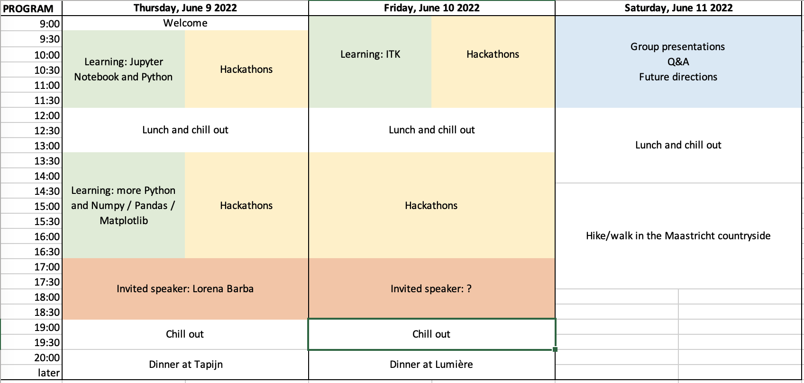

# Building the Jupyter Community in MSK Imaging Research
## A Jupyter Community Workshop sponsored by [NUMFocus](https://numfocus.org/)

Dates: June 9-11, 2022

Venue: [The Student Hotel](https://www.thestudenthotel.com/maastricht/), Sphinxcour 9A, 6211 XZ Maastricht, The Netherlands 

## Preliminary program:

Topics of the hackathon sessions:
- Biomechanics: coming soon!
- SPECTRA: coming soon! 
- knee/ITK: coming soon! 
- Muscle: coming soon! 

## Participants
- [Andrew	Burghardt](https://profiles.ucsf.edu/andrew.burghardt)
- [Andy Kin On Wong](https://www.uhnresearch.ca/researcher/andy-kin-wong)
- [Donnie	Cameron](https://www.spierziektencentrum.nl/person/dr-donnie-cameron/)
- [Dženan	Zukić](https://www.kitware.com/dzenan-zukic/)
- [Enrico	Schileo](https://www.ior.it/en/ricerca-e-innovazione/enrico-schileo-msc-phd)
- [Francesco	Santini](https://www.francescosantini.com/wp/)
- [Fulvia	Taddei](https://www.ior.it/en/ricerca-e-innovazione/fulvia-taddei-biomedical-engineer)
- [Gianluca	Iori](https://github.com/gianthk)
- [Gianluigi	Crimi](https://www.ior.it/en/ricerca-e-innovazione/gianluigi-crimi)
- [Giulia	Fraterrigo](https://www.ior.it/en/ricerca-e-innovazione/ing-giulia-fraterrigo)
- Giulia	Colelli
- [Jilmen	Quintiens](https://www.kuleuven.be/wieiswie/nl/person/00139075)
- [Justin	Tse](https://cumming.ucalgary.ca/labs/manske/our-team/justin-tse)
- [Kathryn	Stok](https://biomedical.eng.unimelb.edu.au/integrative-cartilage/people)
- Leonardo	Barzaghi
- [Majid	Mohammad Sadeghi](https://www.maastrichtuniversity.nl/p70077839)
- [Mariska	Wesseling](https://www.linkedin.com/in/mariska-wesseling-6230b816/?originalSubdomain=nl)
- [Martino	Pani](https://www.port.ac.uk/about-us/structure-and-governance/our-people/our-staff/martino-pani)
- [Michael	Kuczynski](https://cumming.ucalgary.ca/labs/manske/our-team/michael-kuczynski)
- Michelle Alejandra	Espinosa Hernandez
- [Nathan	Neeteson](https://www.ucalgary.ca/labs/bonelab/nathan-neeteson)
- [Pholpat	Durongbhan](https://www.linkedin.com/in/pholpatd/?originalSubdomain=au)
- [Pranjal	Sahu](https://www.kitware.com/pranjal-sahu-ph-d/) / Jared Victory
- [Sarah	Manske](https://cumming.ucalgary.ca/departments/radiology/profiles/sarah-manske)
- [Serena Bonaretti](https://sbonaretti.github.io/)

## Costs covered by [NUMFocus](https://numfocus.org/) 

### Accommodation
- Where: [The Student Hotel](https://www.thestudenthotel.com/maastricht/) 
- Check in: Wednesday, June 8 2022. Check out: Saturday, June 11, 2022. Total nights: 3

### Meals
- Breakfast: June 9-11
- Coffee break: June 9-11
- Lunch: June 9-11
- Dinner on June 9 at [Tapijn Brasserie](https://www.tapijn.nl/)
- Dinner on June 10 at [Lumière](https://lumiere.nl/)
