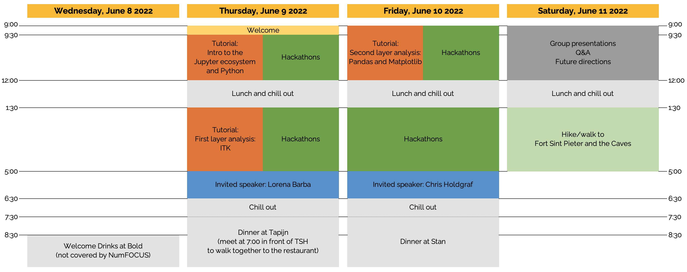
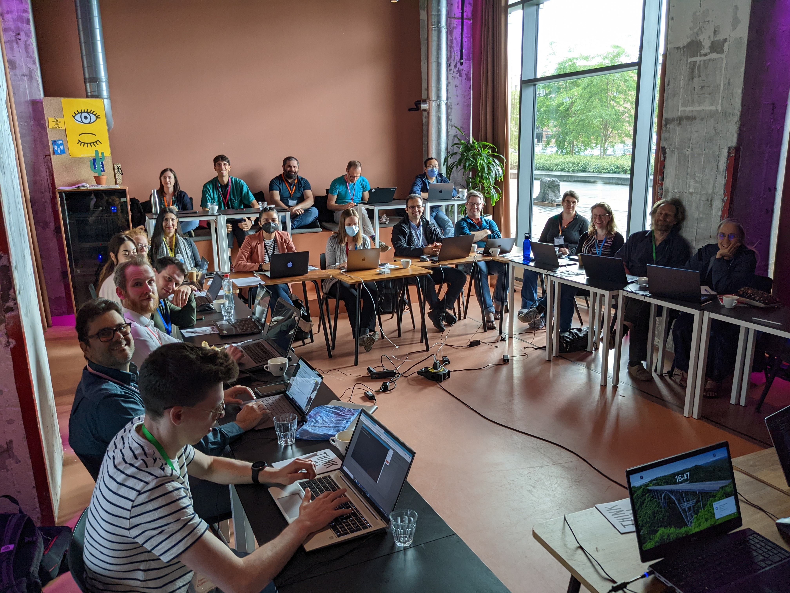

# Building the Jupyter Community in MSK Imaging Research
## A Jupyter Community Workshop sponsored by [NumFOCUS](https://numfocus.org/) and financially supported by Bloomberg and Amazon Web Services
## Organized by and for the [Jupyter Community in MSK Imaging Research](https://jcmsk.github.io/) 

Dates: June 9-11, 2022

Venue: [The Student Hotel](https://www.thestudenthotel.com/maastricht/), Sphinxcour 9A, 6211XZ Maastricht, The Netherlands 

---

In this page, you will find: 

- [Program](#Program)  
  - [Hackathons](#hackathons), [Tutorials](#tutorials), [Invited speakers](#invited-speakers), [Walk/hike](#walkhike), [Other material](#other-material)    
- [Participants](#participants)  
- [Staying, eating, and travelling](#stayingeatingtravelling)    
  - [Accommodation](#accommodation), [Meals](#meals), [Public Transportation](#public-transportation), [Travel reimbursements](#travel-reimbursements)  
- [Tips](#tips)   
  - [What you need to know about the Netherlands](#What-you-need-to-know-about-the-Netherlands), [Practical information about Maastricht](#Practical-information-about-Maastricht), [Things to do or see in Maastricht](#Things-to-do-or-see-in-Maastricht)     
- [More](#more)   
  - [Accepted proposal](#accepted-proposal), [Final budget](#final-budget), [Photos](#photos), [NumFOCUS blog post](#numfocus-blog-post), [Code for badges](#code-for-badges)

---

## Program

### Hackathons 

-  Aims and GitHub repositories at these links:  
   - Ciclope: [aims](./hackathons/biomech.pdf), [GitHub repository](https://github.com/gianthk/ciclope)   
   - Bone erosion: [aims](./hackathons/spectra.pdf)   
   - Muscle BIDS: [aims](./hackathons/muscle.pdf), [GitHub repository](https://github.com/muscle-bids/muscle-bids)   
- Please follow the [coding guidelines](https://jcmsk.github.io/for_contributors.html)!

### Tutorials

- Please, [install Anaconda](https://www.anaconda.com/products/distribution) *before* the workshop! 
- *Intro to the Jupyter ecosystem and Python* and *Second layer analysis: Pandas and Matplotlib*  
  - Instructor: [Serena Bonaretti](https://sbonaretti.github.io/)
  - Material: [here](https://github.com/sbonaretti/2022_JCWMSK_tutorials)
- *First layer analysis: ITK*
  - Instructors: [Dženan Zukić](https://www.kitware.com/dzenan-zukic/) and [Jared Vicory](https://www.kitware.com/jared-vicory/)  
  - Aims: [here](./tutorials/itk.pdf) 
  - Materials:
    1. [ITK in Python](https://mybinder.org/v2/gh/KitwareMedical/2019-03-13-KRSCourseInBiomedicalImageAnalysisAndVisualization/master?filepath=4_ITK_in_Python.ipynb)
    2. Metadata preservation
      - [ITK image grid: image's spatial metadata](https://mybinder.org/v2/gh/InsightSoftwareConsortium/GetYourBrainStraight/main?filepath=HCK01_2022_Virtual/Tutorials/MetadataPreservation/ITK_image_grid.ipynb)
      - [OrientImageFilter for consistent anatomical orientation](https://mybinder.org/v2/gh/InsightSoftwareConsortium/GetYourBrainStraight/main?filepath=HCK01_2022_Virtual/Tutorials/MetadataPreservation/Orient_filter.ipynb)
      - [ITK-NiBabel spatial metadata to 4x4 affine matrix and back](https://mybinder.org/v2/gh/InsightSoftwareConsortium/GetYourBrainStraight/main?filepath=HCK01_2022_Virtual/Tutorials/MetadataPreservation/LPS-RAS-4x4.ipynb)

### Invited speakers
- [Lorena Barba](https://about.me/lorenabarba)
  - Presentation: [here](https://doi.org/10.6084/m9.figshare.21084709.v1)  
- [Chris Holdgraf](https://predictablynoisy.com/)
  - Presentation: [here](https://t.co/8VAsBkyqJw)

### Walk/hike
- Fort Sint Pieter and the Caves
- No special attire is needed. Just wear comfortable shoes    
- Consider bringing raincoat/umbrella in case of rain!  

### Other material 
- Welcome presentation: [.pdf](https://github.com/JCMSK/2022_JCW/blob/main/01_Welcome.pdf), [.pptx](https://github.com/JCMSK/2022_JCW/blob/main/01_Welcome.pptx)

## Participants
- [Andrew	Burghardt](https://profiles.ucsf.edu/andrew.burghardt)
- [Andy Kin On Wong](https://www.uhnresearch.ca/researcher/andy-kin-wong)
- [Donnie	Cameron](https://www.spierziektencentrum.nl/person/dr-donnie-cameron/)
- [Dženan	Zukić](https://www.kitware.com/dzenan-zukic/)
- [Enrico	Schileo](https://www.ior.it/en/ricerca-e-innovazione/enrico-schileo-msc-phd)
- [Francesco	Santini](https://www.francescosantini.com/wp/)
- [Fulvia	Taddei](https://www.ior.it/en/ricerca-e-innovazione/fulvia-taddei-biomedical-engineer)
- [Gianluca	Iori](https://github.com/gianthk)
- [Gianluigi	Crimi](https://www.ior.it/en/ricerca-e-innovazione/gianluigi-crimi)
- [Giulia	Fraterrigo](https://www.ior.it/en/ricerca-e-innovazione/ing-giulia-fraterrigo)
- [Jared Vicory](https://www.kitware.com/jared-vicory/)
- [Jilmen	Quintiens](https://www.kuleuven.be/wieiswie/nl/person/00139075)
- [Judith Cueto Fernandez](https://nl.linkedin.com/in/judith-cueto-fernandez-903a97150)
- [Justin	Tse](https://cumming.ucalgary.ca/labs/manske/our-team/justin-tse)
- [Kathryn	Stok](https://biomedical.eng.unimelb.edu.au/integrative-cartilage/people)
- Leonardo	Barzaghi
- [Majid	Mohammad Sadeghi](https://www.maastrichtuniversity.nl/p70077839)
- [Mariska	Wesseling](https://www.linkedin.com/in/mariska-wesseling-6230b816/?originalSubdomain=nl)
- [Martino	Pani](https://www.port.ac.uk/about-us/structure-and-governance/our-people/our-staff/martino-pani)
- [Michael	Kuczynski](https://cumming.ucalgary.ca/labs/manske/our-team/michael-kuczynski)
- [Michelle Alejandra	Espinosa Hernandez](https://www.linkedin.com/in/michelleaespinosah )
- [Nathan	Neeteson](https://www.ucalgary.ca/labs/bonelab/nathan-neeteson)
- [Pholpat	Durongbhan](https://www.linkedin.com/in/pholpatd/?originalSubdomain=au)
- [Sarah	Manske](https://cumming.ucalgary.ca/departments/radiology/profiles/sarah-manske)
- [Serena Bonaretti](https://sbonaretti.github.io/)

Members of the community who cannot join - We will miss you!
- [Hastings	Greer](https://biag.cs.unc.edu/author/hastings-greer/)
- [Julio	Carballido Gamio](https://profiles.ucdenver.edu/display/12755883)
- [Lorenzo	Grassi](https://portal.research.lu.se/en/persons/lorenzo-grassi)
- [Marc	Niethammer](https://cs.unc.edu/person/marc-niethammer/)
- [Matt	McCormick](https://www.kitware.com/matt-mccormick/)
- [Mojtaba	Barzegari](https://mbarzegary.github.io/)

---

## Staying, eating, and travelling

### Accommodation
- Where: [The Student Hotel](https://www.thestudenthotel.com/maastricht/), Sphinxcour 9A, 6211 XZ Maastricht, The Netherlands
- Check in: Wednesday, June 8, 2022
- Check out: Saturday, June 11, 2022 
- Number of nights: 3

### Meals
- Welcome drinks on June 8 at [Bold](https://www.boldrooftopbar.com/) (not covered by NumFOCUS)     
- Breakfast: June 9-11
- Coffee break: June 9-11
- Lunch: June 9-11
- Dinner on June 9 at [Tapijn Brasserie](https://www.tapijn.nl/)
- Dinner on June 10 at [Stan](https://www.stan-restaurant.nl/en/locations/maastricht/)

### Public transportation 
- Public transportation in The Netherlands is very reliable
- If you travel nationally, you can schedule your trip at [ns.nl](https://www.ns.nl/en)   
- If you travel internationally (e.g. from/to Brussels airport), you can schedule your trip at [nsinternational.com](https://www.nsinternational.com/en)  
- Recommendations: 
  - At Amsterdam Schipol International Airport, train tracks are at the airport hall. You do *not* need to leave the airport building. Buy the ticket in the hall, go downstairs to the tracks, and enjoy the trip!
    
    
    
  - From Amsterdam Schipol International Airport to Maastricht: The trip takes about 2h45'. Consider transfering in Utrecht or 'S-Hertogenbosch (not Amsterdam). *Important*: **Sit in the front of the train**. Sometimes (mainly late at night) the train splits in 2 parts in Eindhoven. The head of the train goes to Maastricht, and the tail of the train goes to Venlo. They communicate the split on the train, but it often is only in Dutch
  - From Maastricht train station to The Student Hotel:
    - By bus: Outside the train station, the bus terminals are on the right. You can buy a ticket on the bus. Several buses go to The Student Hotel and they are very frequent
     
      
  
    - On foot: You can walk through downtown and enjoy the athmosphere! 
      
    
  - How to get to [QMSKI](https://qmski.org/): Take the train from Maastricht to Noordwijk. The trip takes about 3h30'. You can plan your trip on [ns.nl](https://www.ns.nl/en) or Google Maps. If you are on a budget, consider booking a hotel room in Maastricht for Sat/Sun, and then travel on Sunday

### Travel reimbursements
- Travel reimbursements are only for participants from European, Middle Eastern, and one International institutions. Apologies to the people who come from other continents. The budget for traveling was limited and the criterion was to reimburse as many people as possible 
- To get a travel reimbursement, there are 2 steps to be done **by June 30, 2022**:       
  1. Send Serena an email with the amount you are requesting and a copy of the expense receipts in **one single .pdf file**       
  2. Fill out the [reimbursement form](https://numfocus.typeform.com/to/ohD1BM). Suggestions for some of the questions:
    - 1 -> Workshop Name:
      *E: Building the Jupyter community in MSK imaging research* 
    - 4 -> Category
      *Travel*
    - 7-12 -> Your institution address
- Reimbursement guidelines: [here](https://docs.google.com/document/d/1BScRQQnMzppkZmmQvdBKyCoum2Rzh9W3q2JgllPU4rI/edit?usp=sharing)

---
## Tips

### What you need to know about the Netherlands
- Bikers are always right! 
- Coffee shop &#8800; coffe place!

### Practical information about Maastricht 
- Shop hours: 10am-6pm; Sundays: 12pm-6pm
- It might rain: have an umbrella or a raincoat!
- Everybody speaks English!
- If you want to go out for dinner on Saturday night, consider reserving before. Also, restaurants usually do not accept big groups over the weekend

### Things to do or see in Maastricht
- Enjoy downtown, with its restaurants, shops, ancient walls, squares, and churches
- [Dominicanen Boekhandel](https://libris.nl/dominicanen): Gothic cathedral hosting a bookstore and a coffee place
- [De Bisschopsmolen](http://www.molendatabase.nl/nederland/molen.php?nummer=436): Watermill from the 11th century used to grind spelt, which is then used by the [backery](https://www.bisschopsmolen.nl/) next door to bake bread, [Limburg vlaai](https://en.wikipedia.org/wiki/Vlaai), and other delicious products
- [Maastricht library](https://www.centreceramique.nl/): Hosting free exhibitions, with a gorgeous view of Maastricht from the 4th floor
- Market on Friday: 8:00am - 2:00pm 
- Ask for more!

---
## More

### Accepted proposal
Find our accepted proposal on [Zenodo](https://doi.org/10.5281/zenodo.7019810)

### Final budget
Find our final budget [here](./figures/final_budget.pdf)

### Photos

#### Hackathons and tutorials   
     

#### Guest speakers: Lorena Barba and Chris Holdgraf
  

#### Having fun!
  

### NumFOCUS blog post
Coming soon!

### Code for badges
Find [here](https://github.com/JCMSK/2022_JCW/tree/main/code_for_badges) the code we used to create our badges. It creates 3 two-sided bages per paper sheet.

